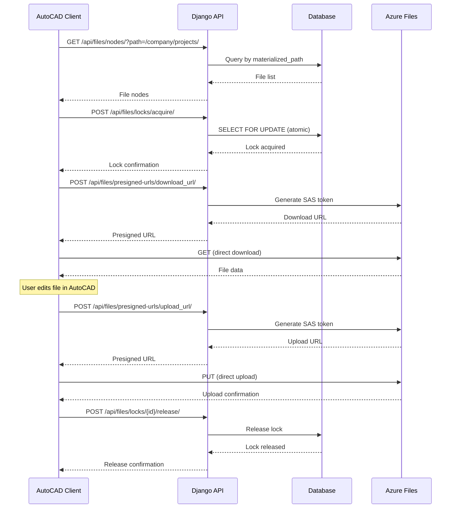

# FileVault System Requirements API Documentation

## Overview

This document describes the API endpoints and implementation details for the FileVault system, covering all core requirements:

1. **Hierarchical Namespace** - Materialized path for infinite tree structure
2. **File Locking** - System-level locking with race condition prevention
3. **Granular ACLs** - User and group-based permissions
4. **Presigned URLs** - Direct storage access without Django proxying

---

## 1. Hierarchical Namespace

### Implementation Details

- **Model**: `FileSystemNode` with `materialized_path` field
- **Path Format**: `/company_slug/folder/subfolder/file.ext`
- **Database Optimization**: Indexed `materialized_path` for fast prefix queries
- **Recursive Operations**: Efficient path-based queries without recursion

### API Endpoints

#### Get Nodes by Path
```
GET /api/files/nodes/?path=/company/projects/
```

**Query Parameters:**
- `path` (string): Materialized path prefix to filter nodes
- `parent` (UUID): Filter by parent node ID
- `company` (UUID): Filter by company ID

**Response:**
```json
{
  "count": 10,
  "results": [
    {
      "id": "uuid",
      "name": "drawing.dwg",
      "type": "file",
      "materialized_path": "/company/projects/phase1/drawing.dwg",
      "size_display": "2.5 MB",
      "breadcrumbs": [
        {"id": "uuid1", "name": "projects", "path": "/company/projects"},
        {"id": "uuid2", "name": "phase1", "path": "/company/projects/phase1"},
        {"id": "uuid3", "name": "drawing.dwg", "path": "/company/projects/phase1/drawing.dwg", "current": true}
      ]
    }
  ]
}
```

#### Create Folder
```
POST /api/files/nodes/
```

**Request Body:**
```json
{
  "name": "new-folder",
  "node_type": "folder",
  "parent": "uuid",
  "company": "uuid"
}
```

#### Get Node Details
```
GET /api/files/nodes/{id}/
```

**Response includes:**
- `materialized_path`: Full path string
- `breadcrumbs`: Array of ancestor nodes
- `children_count`: Number of direct children (for folders)

---

## 2. File Locking System

### Implementation Details

- **Model**: `FileLock` with database-level locking
- **Race Condition Prevention**: Uses `SELECT FOR UPDATE` to ensure atomicity
- **Lock Types**: `exclusive` (default) and `shared`
- **Expiration**: Automatic expiration with configurable timeout
- **Client Info**: JSON field for client identification (hostname, IP, etc.)

### API Endpoints

#### Acquire Lock
```
POST /api/files/locks/acquire/
```

**Request Body:**
```json
{
  "node": "uuid",
  "lock_type": "exclusive",
  "expires_in_minutes": 30,
  "client_info": {
    "hostname": "WORKSTATION-01",
    "ip": "192.168.1.100",
    "application": "AutoCAD 2024"
  }
}
```

**Response (201 Created):**
```json
{
  "id": "uuid",
  "node": "uuid",
  "node_name": "drawing.dwg",
  "locked_by": "uuid",
  "locked_by_name": "John Doe",
  "locked_at": "2024-01-15T10:30:00Z",
  "expires_at": "2024-01-15T11:00:00Z",
  "is_active": true,
  "is_expired": false,
  "time_remaining": 1800,
  "lock_type": "exclusive",
  "client_info": {
    "hostname": "WORKSTATION-01",
    "ip": "192.168.1.100"
  }
}
```

**Error Response (409 Conflict):**
```json
{
  "error": "File is locked by John Doe since 2024-01-15T10:30:00Z"
}
```

#### Release Lock
```
POST /api/files/locks/{id}/release/
```

**Response (200 OK):**
```json
{
  "message": "Lock released successfully"
}
```

**Error Response (403 Forbidden):**
```json
{
  "error": "Only the lock owner can release this lock"
}
```

#### Refresh/Extend Lock
```
POST /api/files/locks/{id}/refresh/
```

**Request Body:**
```json
{
  "additional_minutes": 30
}
```

**Response (200 OK):**
```json
{
  "id": "uuid",
  "expires_at": "2024-01-15T11:30:00Z",
  "time_remaining": 3600
}
```

#### List Locks
```
GET /api/files/locks/
```

**Response:**
```json
{
  "count": 5,
  "results": [
    {
      "id": "uuid",
      "node_name": "drawing.dwg",
      "locked_by_name": "John Doe",
      "locked_at": "2024-01-15T10:30:00Z",
      "is_active": true,
      "time_remaining": 1800
    }
  ]
}
```

### Lock Acquisition Flow

1. **Client requests lock** → API validates permissions
2. **Database transaction starts** → `SELECT FOR UPDATE` on node
3. **Check existing locks** → Reject if active lock exists
4. **Create new lock** → Set expiration and client info
5. **Update node status** → Mark as locked
6. **Commit transaction** → Atomic operation complete

### Race Condition Prevention

The system uses Django's `select_for_update()` which translates to SQL:

```sql
BEGIN TRANSACTION;
SELECT * FROM files_filesystemnode WHERE id = 'uuid' FOR UPDATE;
-- Check locks...
INSERT INTO files_filelock (...);
COMMIT;
```

This ensures that even if two requests arrive in the same millisecond, only one can acquire the lock.

---

## 3. Granular ACLs

### Implementation Details

- **User Permissions**: `UserFilePermission` model
- **Group Permissions**: `GroupFilePermission` model
- **Permission Mask**: Bitmask (1=read, 2=write, 4=execute, 8=delete)
- **Expiration**: Time-based permission expiration
- **Cascade**: Permissions cascade through inheritance (optional)

### API Endpoints

#### Create User Permission
```
POST /api/files/permissions/
```

**Request Body:**
```json
{
  "user": "uuid",
  "node": "uuid",
  "permission_mask": 7,
  "expires_at": "2024-12-31T23:59:59Z"
}
```

**Permission Mask Values:**
- `1` = Read
- `2` = Write
- `4` = Execute
- `8` = Delete
- `7` = Read + Write + Execute (1+2+4)
- `15` = Full permissions (1+2+4+8)

**Response:**
```json
{
  "id": "uuid",
  "user": "uuid",
  "user_name": "Jane Doe",
  "node": "uuid",
  "node_name": "drawing.dwg",
  "permission_mask": 7,
  "perm_labels": ["ler", "escrever", "executar"],
  "assigned_by": "uuid",
  "assigned_by_name": "Admin",
  "assigned_at": "2024-01-15T10:30:00Z",
  "expires_at": "2024-12-31T23:59:59Z",
  "is_active": true
}
```

#### Create Group Permission
```
POST /api/files/group-permissions/
```

**Request Body:**
```json
{
  "group": "uuid",
  "node": "uuid",
  "permission_mask": 3,
  "expires_at": "2024-12-31T23:59:59Z"
}
```

**Response:**
```json
{
  "id": "uuid",
  "group": "uuid",
  "group_name": "Engineering",
  "node": "uuid",
  "node_name": "drawing.dwg",
  "permission_mask": 3,
  "perm_labels": ["ler", "escrever"],
  "assigned_by": "uuid",
  "assigned_by_name": "Admin",
  "assigned_at": "2024-01-15T10:30:00Z",
  "is_active": true
}
```

#### List Permissions
```
GET /api/files/permissions/?node=uuid
GET /api/files/group-permissions/?node=uuid
```

#### Update Permission
```
PATCH /api/files/permissions/{id}/
```

**Request Body:**
```json
{
  "permission_mask": 15
}
```

#### Delete Permission
```
DELETE /api/files/permissions/{id}/
```

### Permission Checking

The system checks permissions in this order:

1. **User-specific permissions** (highest priority)
2. **Group permissions** (user's department)
3. **Default permissions** (role-based)
4. **Deny by default** (if no permissions found)

---

## 4. Presigned URLs

### Implementation Details

- **Service**: `PresignedURLService` for Azure Files
- **Fallback**: `LocalPresignedURLService` for local storage
- **SAS Tokens**: Azure Shared Access Signatures for time-limited access
- **Direct Access**: Client uploads/downloads directly to/from Azure Files
- **No Proxying**: Django does not stream file data

### API Endpoints

#### Generate Upload URL
```
POST /api/files/presigned-urls/upload_url/
```

**Request Body:**
```json
{
  "file_path": "files/2024/01/drawing.dwg",
  "expires_in_minutes": 60,
  "max_file_size": 104857600
}
```

**Response:**
```json
{
  "upload_url": "https://account.file.core.windows.net/share/files/2024/01/drawing.dwg?sv=2023-01-03&...",
  "method": "PUT",
  "headers": {
    "x-ms-file-type": "file",
    "x-ms-content-length": "104857600"
  },
  "expires_at": "2024-01-15T11:30:00Z",
  "file_path": "files/2024/01/drawing.dwg"
}
```

**Client Usage:**
```javascript
// Upload directly to Azure Files
const response = await fetch(uploadUrl, {
  method: 'PUT',
  headers: {
    'x-ms-file-type': 'file',
    'x-ms-content-length': fileSize.toString()
  },
  body: file
});
```

#### Generate Download URL
```
POST /api/files/presigned-urls/download_url/
```

**Request Body:**
```json
{
  "file_path": "files/2024/01/drawing.dwg",
  "expires_in_minutes": 60,
  "content_disposition": "attachment; filename=\"drawing.dwg\""
}
```

**Response:**
```json
{
  "download_url": "https://account.file.core.windows.net/share/files/2024/01/drawing.dwg?sv=2023-01-03&...",
  "method": "GET",
  "expires_at": "2024-01-15T11:30:00Z",
  "file_path": "files/2024/01/drawing.dwg"
}
```

**Client Usage:**
```javascript
// Download directly from Azure Files
window.location.href = downloadUrl;
```

#### Generate Delete URL
```
POST /api/files/presigned-urls/delete_url/
```

**Request Body:**
```json
{
  "file_path": "files/2024/01/drawing.dwg",
  "expires_in_minutes": 10
}
```

**Response:**
```json
{
  "delete_url": "https://account.file.core.windows.net/share/files/2024/01/drawing.dwg?sv=2023-01-03&...",
  "method": "DELETE",
  "expires_at": "2024-01-15T10:40:00Z",
  "file_path": "files/2024/01/drawing.dwg"
}
```

### Upload Flow with Presigned URLs

1. **Client requests upload URL** → API validates permissions
2. **API generates SAS token** → Time-limited write access
3. **Client uploads directly** → To Azure Files (bypassing Django)
4. **Client confirms upload** → API updates database record
5. **Django never streams** → No memory overhead

### Benefits

- **Performance**: No Django memory overhead for large files
- **Scalability**: Direct client-to-storage transfer
- **Security**: Time-limited SAS tokens
- **Reliability**: Azure handles retries and error handling

---

## 5. Complete Workflow Example

### AutoCAD File Edit Workflow



---

## 6. Testing

### Run Test Suite

```bash
cd DJANGO
python test_system_requirements.py
```

### Test Coverage

The test suite validates:

1. **Hierarchical Namespace**
   - Materialized path generation
   - Path-based queries
   - Ancestor/breadcrumb navigation
   - Deep nesting performance

2. **File Locking**
   - Lock acquisition
   - Lock release
   - Lock expiration
   - Lock refresh

3. **Race Conditions**
   - Concurrent lock attempts (10 threads)
   - Database-level locking
   - Atomic operations

4. **ACLs**
   - User-specific permissions
   - Group-based permissions
   - Permission expiration
   - Permission mask validation

5. **Presigned URLs**
   - Upload URL generation
   - Download URL generation
   - Delete URL generation
   - SAS token validation

---

## 7. Configuration

### Azure Files Configuration

```env
AZURE_STORAGE_ACCOUNT_NAME=your_account
AZURE_STORAGE_ACCOUNT_KEY=your_key
AZURE_STORAGE_SHARE_NAME=filevault
AZURE_STORAGE_IOPS_LIMIT=1000
```

### Lock Configuration

```python
# Default lock expiration (minutes)
DEFAULT_LOCK_EXPIRATION = 30

# Maximum lock expiration (minutes)
MAX_LOCK_EXPIRATION = 1440  # 24 hours
```

### Permission Configuration

```python
# Default permission mask for new files
DEFAULT_FILE_PERMISSION = 1  # Read only

# Default permission mask for new folders
DEFAULT_FOLDER_PERMISSION = 7  # Read + Write + Execute
```

---

## 8. Security Considerations

### File Locking
- Locks are tied to user authentication
- Only lock owner can release/refresh
- Admins can force release locks
- Client info stored for audit trail

### Presigned URLs
- SAS tokens are time-limited (max 24 hours)
- URLs are single-use (recommended)
- File size limits enforced
- IP restrictions can be added

### ACLs
- Permissions are company-isolated
- Expired permissions are automatically ignored
- Permission changes are audited
- Deny-by-default policy

---

## 9. Performance Optimizations

### Database Indexes

```python
# FileSystemNode indexes
- ['company', 'materialized_path']  # Fast path queries
- ['parent', 'name']  # Sibling queries
- ['node_type', 'company']  # Type filtering
- ['is_deleted', 'company']  # Soft delete queries

# FileLock indexes
- ['node', 'is_active']  # Active lock lookup
- ['locked_by', 'is_active']  # User lock lookup
- ['expires_at']  # Expired lock cleanup

# Permission indexes
- ['user', 'node', 'is_active']  # User permission lookup
- ['group', 'node', 'is_active']  # Group permission lookup
```

### Query Optimization

- Use `select_related` for foreign keys
- Use `prefetch_related` for many-to-many
- Materialized path avoids recursive queries
- Database constraints prevent duplicate locks

---

## 10. Error Handling

### Common Error Responses

**409 Conflict (File Locked)**
```json
{
  "error": "File is locked by John Doe since 2024-01-15T10:30:00Z"
}
```

**403 Forbidden (No Permission)**
```json
{
  "error": "No write permission on this file"
}
```

**429 Too Many Requests (IOPS Limit)**
```json
{
  "error": "Limite de operações de storage excedido. Tente novamente mais tarde.",
  "retry_after": 1
}
```

**400 Bad Request (Invalid Input)**
```json
{
  "error": "Permissão inválida."
}
```
